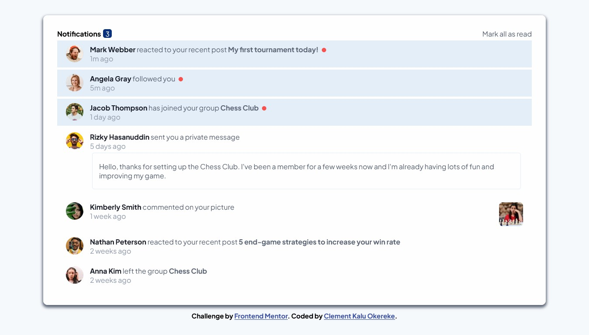
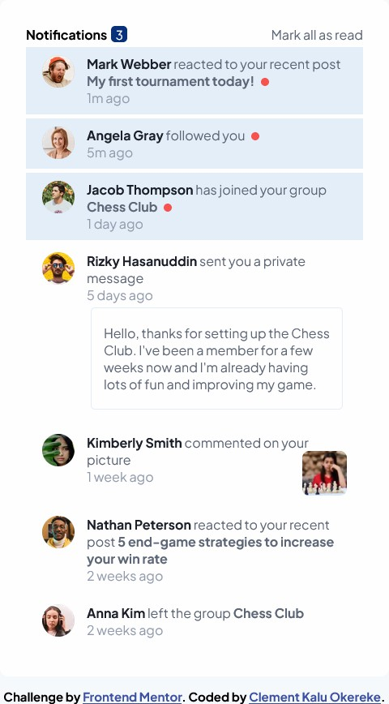

# Frontend Mentor - Notifications page solution

This is a solution to the [Notifications page challenge on Frontend Mentor](https://www.frontendmentor.io/challenges/notifications-page-DqK5QAmKbC). Frontend Mentor challenges help you improve your coding skills by building realistic projects. 

## Table of contents

- [Overview](#overview)
  - [The challenge](#the-challenge)
  - [Screenshot](#screenshot)
  - [Links](#links)
- [My process](#my-process)
  - [Built with](#built-with)
  - [What I learned](#what-i-learned)
  - [Continued development](#continued-development)
  - [Useful resources](#useful-resources)
- [Author](#author)
- [Acknowledgments](#acknowledgments)


## Overview

### The challenge

Your challenge is to build out this notifications page and get it looking as close to the design as possible.


Users should be able to:

- Distinguish between "unread" and "read" notifications
- Select "Mark all as read" to toggle the visual state of the unread notifications and set the number of unread messages to zero
- View the optimal layout for the interface depending on their device's screen size
- See hover and focus states for all interactive elements on the page

### Screenshot

**Desktop Design** 



**Mobile Design**



### Links

- Solution URL: [Solution URL ](https://github.com/Clement1kalu-okereke/notification-page-main)
- Live Site URL: [Live site URL](https://animated-gecko-b71a80.netlify.app/)

## My process

### Built with

- Semantic HTML5 markup
- CSS custom properties
- Flexbox
- CSS Grid
- Mobile-first workflow


### What I learned

While making this project, I had a lot of fun and it also required critical thinking. I learned how to use the HTML classList 
DOM object and how to use some of it's classes like 
    - `remove()`
    - `add()`
    - `toggle()`

Like so: 
```js
not1.classList.add('unread')
    not3.classList.add('unread')
    not2.classList.add('unread')
```

### Continued development

While building future projects, I hope to work more with HTML DOM elements 


## Author


- Website - [Clement Kalu Okereke](https://clement-portfolio.w3spaces.com)
- Frontend Mentor - [@Clement1kalu-okereke](https://www.frontendmentor.io/profile/Clement1kalu-okereke)
- Twitter - [@ClementKaluoke2](https://www.twitter.com/ClementKaluoke2)


